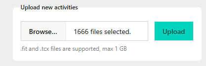

# Activities: self-hosted training journal and performance tracking platform

Activities is a self-hosted platform for athletes to archive their activities
and manage their training journal, and track their progress:

- Track your training history with custom metrics and periods,
- Keep a training journal with notes on workouts and training blocks,
- Explore your performance data and visualize your progress,
- It can be deployed from a single Docker image,
- It supports importing activities from `.tcx` and `.fit` files.

## How to deploy

The application comes in two versions depending on how many users you plan to
give access to your instance:

- _multi-user_: allows multiple users to use your instance using an email-based
  password-less authentication process. You will need a valid SMTP server for
  sending emails containing magic link to users.
- _single-user_: allows a single user to use the instance without an
  authentication step, and thus does not require an external email server to
  work. Note that there is **NO authentication process** for this version, so be
  careful where you plan to host it, as your activities will be accessible to
  anyone that can reach your instance.

Beside the authentication process, both versions offer the same set of features.

### Available images

- multi-user: `ghcr.io/thomas-god/activities:multi-user-main`,
- single-user: `ghcr.io/thomas-god/activities:single-user-main`.

All images are available for both `amd64` and `arm64`.

### Quick start: try it locally

You can quickly test the application locally with a single Docker command:

```bash
docker run --rm -p 8080:80 \
  -e ACTIVITIES_DATA_PATH=/app/data \
  ghcr.io/thomas-god/activities:single-user-main
```

Then open http://localhost:8080 in your browser. Your data will be stored in an
anonymous Docker volume and will be lost when you stop the container. To persist
your data, add a volume mount:

```bash
docker run --rm -p 8080:80 \
  -e ACTIVITIES_DATA_PATH=/app/data \
  -v activities_data:/app/data \
  ghcr.io/thomas-god/activities:single-user-main
```

### Using _docker-compose_ or _docker-stack_

The most basic `docker-compose.yaml` file looks like that:

```yaml
services:
  activities:
    image: ghcr.io/thomas-god/activities:single-user-main
    environment:
      ACTIVITIES_DATA_PATH: /app/data
    volumes:
      - activities_data:/app/data

volumes:
  activities_data:
```

The application will store all its data at the location pointed by
`ACTIVITIES_DATA_PATH`, so use a docker volume to persist your data between
restarts and to facilitate the backup process.

### Configuration

The application expect the following environment variables to be set. Each
environment variable supports a `*_FILE` variant to load the variable content
from a file
[instead](https://docs.docker.com/engine/swarm/secrets/#build-support-for-docker-secrets-into-your-images).

#### All versions

| Variable name        | Required | Purpose                            | Example   |
| -------------------- | -------- | ---------------------------------- | --------- |
| ACTIVITIES_DATA_PATH | yes      | Location to store application data | /app/data |

#### Multi-user version

| Variable name              | Required | Purpose                                                                                                                                         | Example                 |
| -------------------------- | -------- | ----------------------------------------------------------------------------------------------------------------------------------------------- | ----------------------- |
| ACTIVITIES_MAILER_FROM     | yes      |                                                                                                                                                 | no-reply@your.domain    |
| ACTIVITIES_MAILER_USERNAME | yes      | SMTP username                                                                                                                                   |                         |
| ACTIVITIES_MAILER_PASSWORD | yes      | SMTP password                                                                                                                                   |                         |
| ACTIVITIES_MAILER_RELAY    | yes      | SMTP server                                                                                                                                     |                         |
| ACTIVITIES_MAILER_DOMAIN   | yes      | The domain on which your instance is hosted. Used to craft the magic link url. Can be a different domain than the one used by your SMTP server. | https://app.your.domain |

## Upload your training history

Most device manufacturers and training platforms allow you to download your
activities history:

- _Coros_: Training Hub > Activity List > Export Data
- _Garmin Connect_: Account Settings > Account Information > Export all of your
  Garmin data
- _Strava_: Settings > My Account > Download or Delete Your Account

They will usually send you a link by email to download an archive containing all
your data. Depending on the archive format you should find an activities folder
containing `.fit` and or `.tcx` files, often compressed in `.gz`.

Then simply upload those files (including compressed ones) using the upload
form. It can take a few minutes depending of your history size but then you are
good to go!



## Intended scope and limitations

- The application focuses on providing athletes with tools to track and analyze
  their training: organizing activities into training periods, keeping training
  notes, defining custom metrics, and visualizing performance trends. While
  social features like friends, timeline, or sharing are not planned,
  coaching-related features might be considered in the future.
- Because the application is designed to be self-hosted, and since sport device
  ecosystems are mostly closed, there is sadly no feature to automatically
  import your activities from your devices.

## Design decisions

Key design decisions are documented [here](adr/README.md).

## Credits

Favicon icon from [OpenMoji](https://openmoji.org/) – the open-source emoji and
icon project. License:
[CC BY-SA 4.0](https://creativecommons.org/licenses/by-sa/4.0/)
